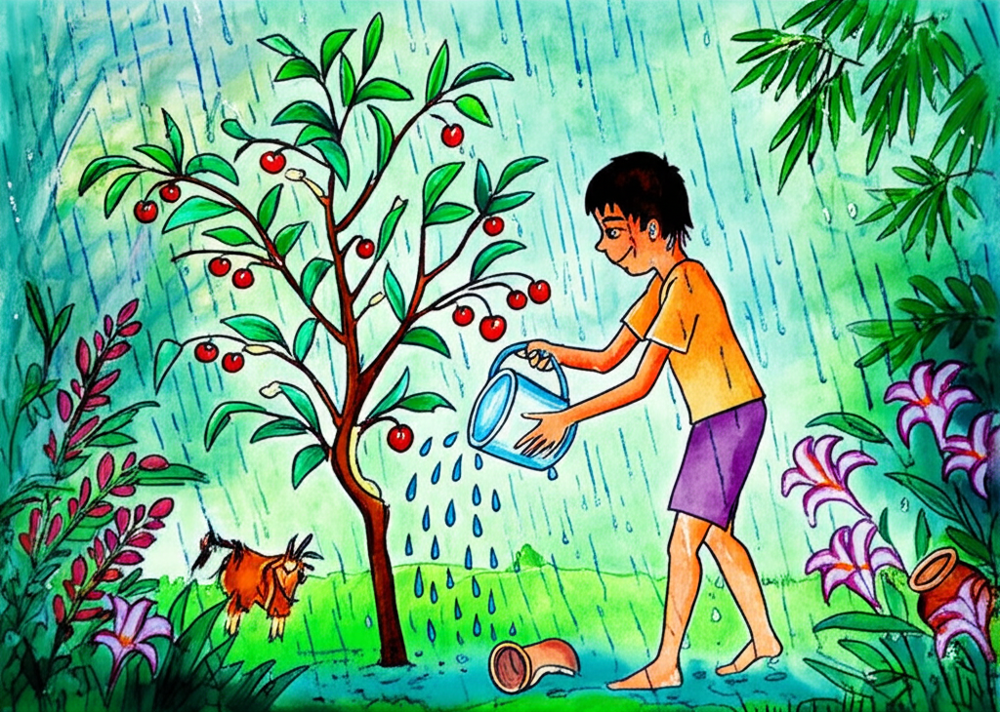

One day, when Rakesh was six years old, he walked home from the Mussoorie market eating cherries. They tasted a little sweet and a little sour. They were small, bright red cherries that had traveled all the way from the Kashmir Valley. 

In the Himalayan hills where Rakesh lived, there weren't many fruit trees. The ground was rocky, and the cold winds didn't let most plants grow very big. But on the slopes that weren't as windy, there were forests of oak and deodar trees. 

Rakesh lived with his grandpa on the edge of Mussoorie, right where the forest started. His mom and dad lived in a small village about 50 miles away. They grew corn, rice, and barley in narrow fields that looked like stairs on the side of the mountain. But there were no schools in their village, and Rakesh's parents really wanted him to go to school. So, as soon as he was old enough, they sent him to stay with his grandpa in Mussoorie. 

He lived in a little house outside of town. 

Rakesh was walking home from school when he bought the cherries. He paid 50 paise for the bunch. It took him about half an hour to walk home, and by the time he got to the house, he only had three cherries left. 

'Have a cherry, Grandpa!' he said as soon as he saw his grandpa in the garden. 

Grandpa took one cherry, and Rakesh quickly ate the other two. He kept the last seed in his mouth for a while, rolling it around on his tongue until all the flavor was gone. Then he put the seed in his hand and looked at it closely. 

'Are cherry seeds lucky?' Rakesh asked. 

'Of course!' 

'Then I'll keep it!' 

'Nothing is lucky if you just put it away. If you want luck, you have to use it for something.' 

'What can I do with a seed?' 

'Plant it!' 

So, Rakesh found a small spot and started to dig in a flower bed. 

'Hey, not there!' said Grandpa. 'I planted mustard seeds in that bed. Plant it in that shady corner, where it won't be bothered.' 

Rakesh went to a corner of the garden where the dirt was soft. He didn't even have to dig. He pushed the seed into the soil with his thumb, and it went right in. Then he ate his lunch and ran off to play cricket with his friends, and he forgot all about the cherry seed. 

When it was winter in the hills, a cold wind blew down from the snowy mountains and went whoo-whoo-whoo through the deodar trees. The garden was dry and empty. In the evenings, Grandpa and Rakesh sat by a charcoal fire, and Grandpa told Rakesh stories – stories about people who turned into animals, ghosts who lived in trees, and beans that jumped and stones that cried. Then Rakesh would read to him from the newspaper, because Grandpa's eyes weren't very good. Rakesh thought the newspaper was very boring – especially after the exciting stories – but Grandpa wanted to know all the news... 

They knew it was spring when the wild ducks flew north again to Siberia. Early in the morning, when he got up to chop wood and start a fire, Rakesh saw the ducks flying in a V-shape to the north. He could hear their calls clearly in the mountain air. 

One morning in the garden, he bent down to pick up what he thought was a small stick, and he was surprised to see that it had roots. He stared at it for a moment, then ran to get Grandpa, shouting, 'Grandpa, come and look! The cherry tree has come up!' 

'What cherry tree?' Grandpa asked, because he had forgotten about it. 'The seed we planted last year – look, it's come up!' 

Rakesh knelt down, and Grandpa bent over and looked at the tiny tree. It was about four inches tall. 

'Yes, it's a cherry tree,' said Grandpa. 'You should water it now and then.' 

Rakesh ran inside and came back with a bucket of water. 

'Don't drown it!' said Grandpa. 

Rakesh gave it a little sprinkle and put pebbles around it. 

'What are the pebbles for?' asked Grandpa. 

'For privacy!' said Rakesh. 

He looked at the tree every morning, but it didn't seem to be growing very fast, so he stopped looking at it very much, except for a quick glance. After a week or two, when he finally let himself look at it closely, he saw that it had grown – at least an inch! 

That year, the rainy season started early, and Rakesh walked to and from school in a raincoat and sandals. Ferns grew on the trunks of trees, strange-looking lilies popped up in the long grass, and even when it wasn't raining, the trees dripped and mist floated up the valley. The cherry tree grew quickly during this time. 

It was about two feet tall when a goat came into the garden and ate all the leaves. Only the main part of the tree and two thin branches were left. 

'Never mind,' said Grandpa, seeing that Rakesh was sad. 'It will grow again. Cherry trees are strong.' 

Towards the end of the rainy season, new leaves appeared on the tree. Then a woman cutting grass walked down the hill, swinging her tool through the thick plants. She didn't try to miss the tree. With one swing, she cut the cherry tree in two. 

When Grandpa saw what had happened, he went after the woman and told her she shouldn't have done that, but the damage was done. 

'Maybe it will die now,' said Rakesh. 

'Maybe,' said Grandpa. 

But the cherry tree didn't want to die. 

By the time summer came again, it had grown several new stems with soft, green leaves. Rakesh had grown taller, too. He was eight now, a strong boy with curly black hair and dark black eyes. 'Blackberry eyes,' Grandpa called them. 

That rainy season, Rakesh went home to his village to help his mom and dad plant and plow. He was thinner but stronger when he came back to Grandpa's house at the end of the rains. He found that the cherry tree had grown another foot. It was now up to his chest. 

Even when it was raining, Rakesh would sometimes water the tree. He wanted it to know that he was there. 

One day, he found a bright green praying mantis sitting on a branch, looking at him with big eyes. Rakesh let it stay there. It was the cherry tree's first visitor. 

The next visitor was a hairy caterpillar, who started eating the leaves. Rakesh quickly took it off and put it on a pile of dry leaves. 

'Come back when you're a butterfly,' he said. 

Winter came early. The cherry tree bent down with the weight of the snow. Field mice hid in the roof of the house. The road from the valley was blocked, and for several days there was no newspaper, which made Grandpa grumpy. His stories started to have sad endings. 

In February, it was Rakesh's birthday. He was nine – and the tree was four, but almost as tall as Rakesh. 

One morning, when the sun came out, Grandpa went into the garden to 'let some warmth get into my bones,' as he said. He stopped in front of the cherry tree, looked at it for a few moments, and then called out, 'Rakesh! Come and look! Come quickly before it falls!' 

Rakesh and Grandpa stared at the tree as if it had done something amazing. There was a light pink flower at the end of a branch! 

The next year, there were more flowers. And suddenly, the tree was taller than Rakesh, even though it was less than half his age. And then it was taller than Grandpa, who was older than some of the oak trees. 

But Rakesh had grown, too. He could run, jump, and climb trees as well as most boys, and he read a lot of books, although he still liked listening to Grandpa's stories. 

In the cherry tree, bees came to eat the sweet nectar in the flowers, and tiny birds pecked at the flowers and broke them off. But the tree kept blooming all through the spring, and there were always more flowers than birds could eat. 

That summer, there were small cherries on the tree. Rakesh tasted one and spit it out. 

'It's too sour!' he said. 

'They'll be better next year,' said Grandpa. 

But the birds liked them – especially the bigger birds, like bulbuls and scarlet minivets. They flew in and out of the leaves, eating the cherries. 

One warm, sunny afternoon, when even the bees looked sleepy, Rakesh was looking for Grandpa but couldn't find him in any of his favorite places around the house. Then he looked out of the bedroom window and saw Grandpa relaxing in a chair under the cherry tree. 

'There's just the right amount of shade here,' said Grandpa. 'And I like looking at the leaves.' 

'They're pretty leaves,' said Rakesh. 'And they're always ready to dance if there's a breeze.' 

After Grandpa came inside, Rakesh went into the garden and lay down on the grass under the tree. He looked up through the leaves at the big blue sky. When he turned on his side, he could see the mountains disappearing into the clouds. He was still lying under the tree when the evening shadows stretched across the garden. 

Grandpa came back and sat down next to Rakesh, and they waited quietly until the stars came out and the nightjar bird started to call. In the forest below, the crickets and cicadas started making noise, and suddenly the trees were filled with the sound of insects. 

'There are so many trees in the forest,' said Rakesh. 'What's so special about this tree? Why do we like it so much?' 

'We planted it ourselves,' said Grandpa. 'That's why it's special.' 

'Just one small seed,' said Rakesh, and he touched the smooth bark of the tree that he had grown. He ran his hand along the trunk of the tree and put his finger to the tip of a leaf. 'I wonder,' he whispered. 'Is this what it feels like to be God?'