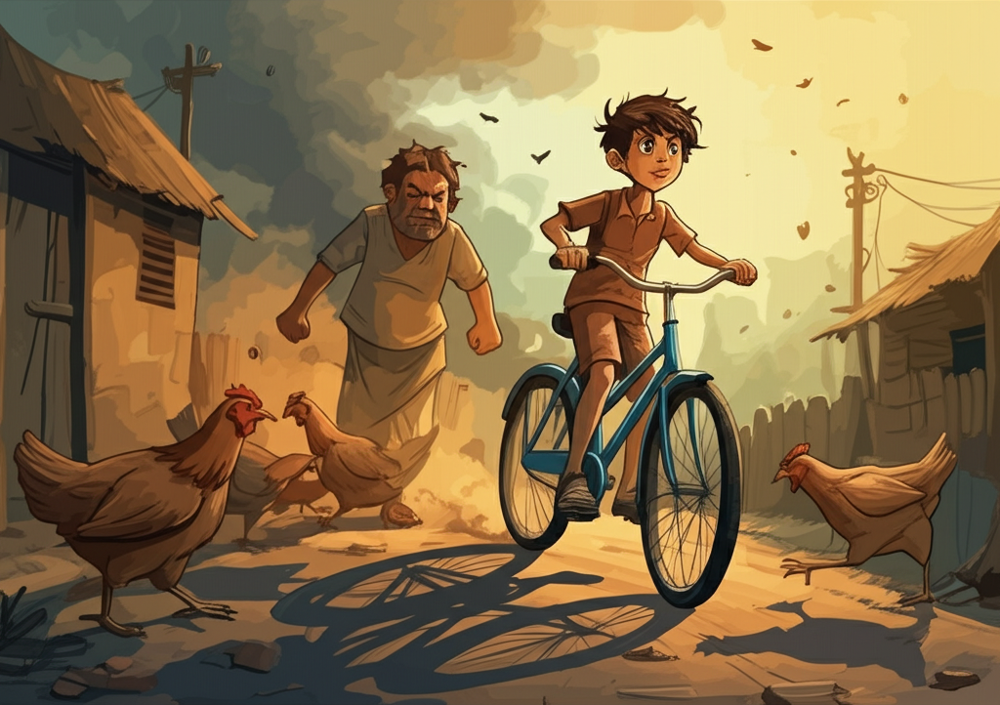
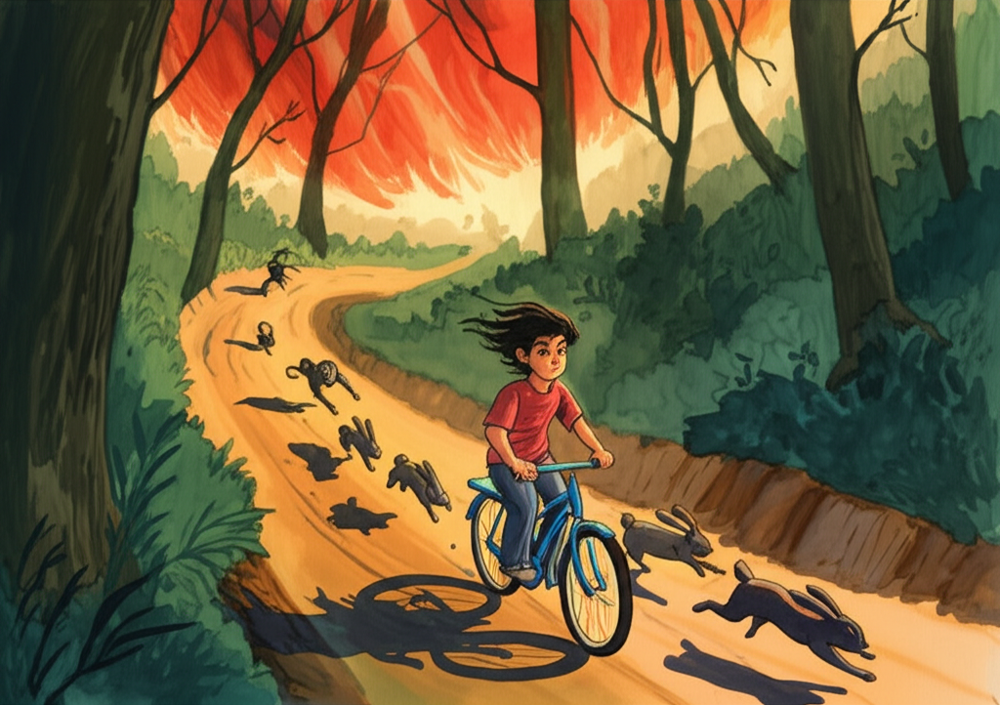
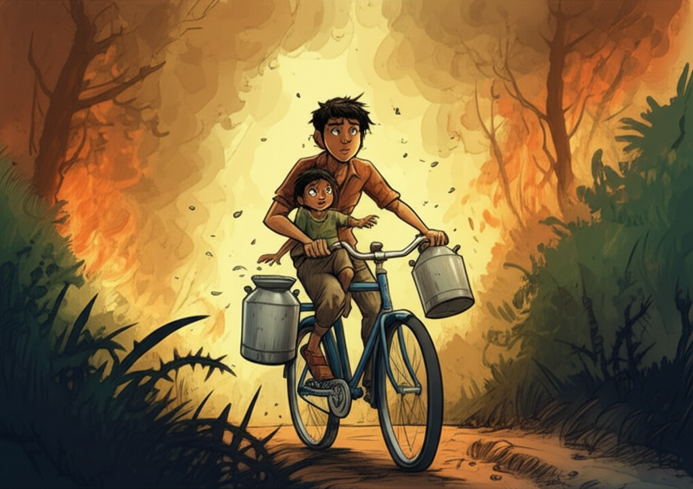
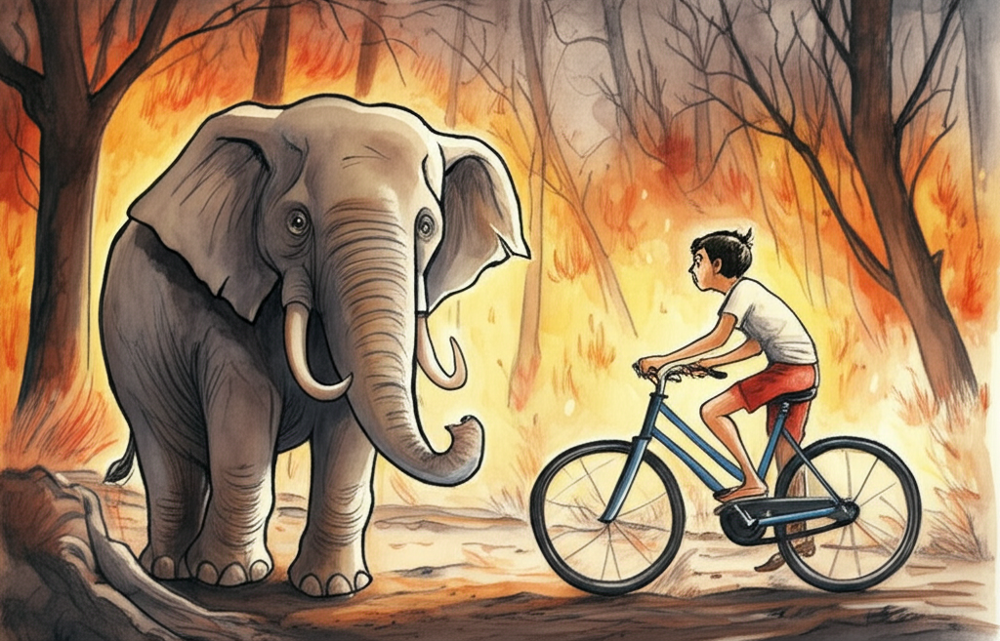
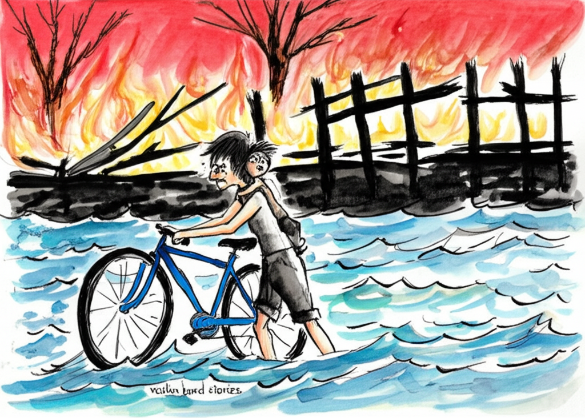
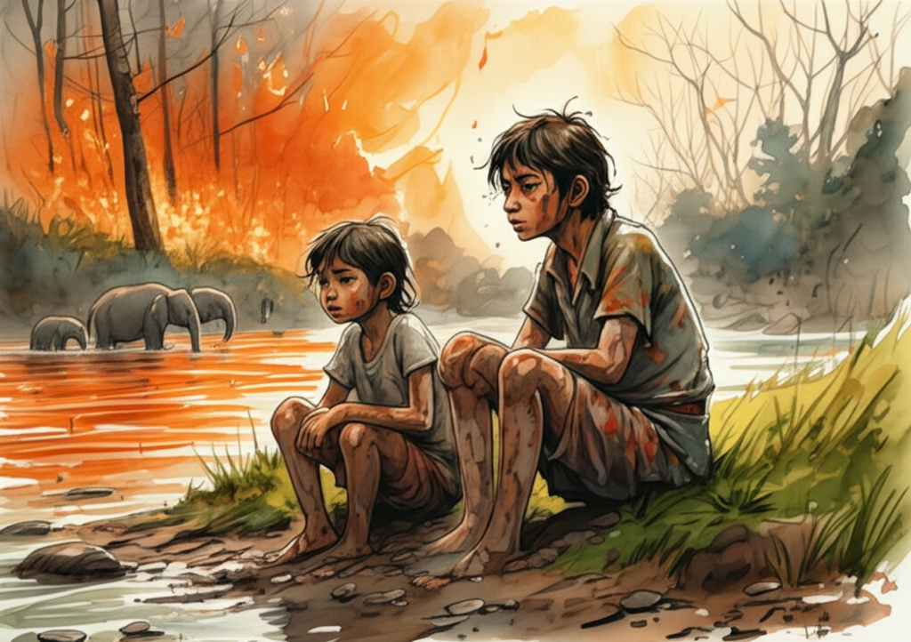

As Romi was about to hop on his bike, he saw smoke way off in the distance, behind the trees.

‘Looks like a forest fire!’ said Prem, his friend from school.

‘It's far to the side,’ Romi said. ‘Nowhere near the road.’

‘The wind is super strong,’ Prem said, watching dry leaves swirl around the road.

It was the middle of May, and it hadn't rained in the area for weeks. The grass was brown, and the leaves on the trees were dusty. Even though it was almost six in the evening, the boys' shirts were sweaty.

‘It’s going to get dark soon,’ said Prem. ‘You should stay at my place tonight.’

‘No, I told my family I'd be home. My dad isn't feeling well. The doctor gave me some medicine for him.’

‘You better hurry, then. That fire looks like it's getting bigger.’

‘Oh, it’s far away. It will only take me forty minutes to ride through the forest. Bye, Prem – see you tomorrow!’

Romi jumped on his bike and started pedaling down the main road of the village, making chickens, dogs, and people scatter.

‘Hey, watch where you’re going!’ yelled an angry villager, jumping out of the way of the bike. ‘Do you think you own the road?’

‘Of course I do!’ Romi called back, laughing, and kept riding.

His village was about seven miles away, on the other side of the forest. There was only a small school in his village, and Romi was now in a bigger school in the next town. His dad, who was a rich sugarcane farmer, had just bought him the bike. Romi didn’t really love school and wished there were more breaks, but he liked the long bike rides and his classmates.

He might have stayed with Prem, but he had to get the medicine from the village doctor to his dad.

Romi’s dad had a bad back, and the medicine was made specially from plants nearby.

Since he had such a cool new bike, Romi wanted to get the medicine to his dad as soon as he could.

He lowered his head and rode quickly out of the village. Ahead of him, smoke rose from the burning forest, and the sky glowed red.

He soon left the village behind. There was a small hill, and Romi had to push harder to get to the top. Once he was over, the road went downhill towards the forest.

This was Romi's favorite part. He relaxed, stopped pedaling, and let the bike roll gently down the hill. The wind rushed past him, blowing his hair and making his shirt puff out. He started singing.

A dog from the village ran beside him, barking loudly. Romi shouted to the dog, cheering him on in the race.

Then the road became straight, and Romi started pedaling again.

The dog, seeing the forest ahead, turned back to the village. It was scared of the forest.

The smoke was thicker now, and Romi smelled burning wood. But the road ahead was clear. He kept riding.

It was a bumpy, dusty road that went straight through the forest. Tall trees grew on both sides, blocking the last of the sunlight. But the red glow of the fire lit up the road, and giant shadows of trees danced in front of Romi on his bike.

Usually the road was empty. But tonight, it was full of animals running from the fire.

The first animal Romi saw was a rabbit, hopping across the road. Then, more rabbits followed. After that, a group of monkeys rushed across, chattering loudly.

They'll be safe on the other side, Romi thought. The fire won't cross the road.

But it was getting closer. Romi realized this and pedaled faster. He should be out of the forest in half an hour.

Suddenly, some birds flew up from the side of the road and swooshed across the path right in front of Romi’s bike. He was so surprised that he fell off. He got up and brushed off his clothes, and then he saw his knee was bleeding. It wasn't a big cut, but he let it bleed a little, took out his handkerchief, and wrapped his knee. Then he got back on his bike.

He rode a little slower now, because more birds and animals kept coming out of the bushes.

Not just birds, but smaller birds too, were flying across the road – parrots, crows, owls, and others. The air was filled with their calls.

‘Everyone’s running away,’ Romi thought. ‘This must be a huge fire.’

He could see the flames now, reaching out from behind the trees on his right. He could hear the crackling as the dry leaves caught fire. The air felt hot on his face.

Burning leaves floated past.

A group of deer crossed the road, and Romi had to stop. Then he got back on and rode on, but now he was feeling scared.

From ahead, he heard a faint clanging sound. It didn't sound like an animal. Was it a fire truck? But there weren’t any fire trucks nearby.

The clanging got closer, and Romi saw a little boy running along the forest path, carrying two milk cans that were making the noise.

‘Teju!’ Romi called, recognizing the boy from a nearby village. ‘What are you doing out here?’

‘Trying to get home, of course!’ said Teju, running beside the bike.

‘Jump on!’ Romi said, stopping for him.

Teju was only eight or nine – a few years younger than Romi. He had brought milk to some workers on the road, but the workers had left when they saw the fire. Teju was hurrying home with his cans still full of milk.

He climbed onto the bar of the bike, and Romi started riding again. He often gave his friends rides.

‘Keep banging your milk cans,’ Romi said. ‘That way, the animals will know we’re coming. My bell isn’t loud enough. I need a horn for my bike!’

‘I didn’t know there were so many animals in the forest,’ Teju said. ‘I saw a big snake in the road! It was stretched all the way across!’

‘What did you do?’

‘I just ran really fast and jumped over it!’

Teju kept talking, but Romi was thinking about the fire, which was much closer now. Flames shot up from the dry grass and climbed up the trees. Smoke filled the air above the forest.

Romi’s eyes were burning, and his hair felt hot. He was tired, but he couldn’t stop now. He had to get away from the fire. Ten or fifteen more minutes of riding would get them to the little wooden bridge that crossed the river between the forest and the sugarcane fields.

Once they crossed the river, they would be safe. The fire couldn’t reach them on the other side, because the forest ended at the river.

But could they get to the river in time?

Clang, clang, clang, went Teju’s milk cans. But the sound of the fire was getting louder, too.

A tall tree, with branches reaching over the road, had caught fire. They were almost under it when there was a crash and a burning branch fell in front of them.

The boys had to get off the bike and leave the road, pushing through thorny bushes on the left, pulling and pushing the bike. They got back on the road further ahead of the burning tree.

‘We won’t get out in time,’ said Teju, back on the bar but feeling sad.

‘Yes, we will,’ said Romi, pedaling as hard as he could. ‘The fire hasn’t crossed the road yet.’

Even as he said that, he saw a small flame jump up from the grass on the left. Soon, sparks and burning leaves would blow across the road and start a fire on the other side.

‘Oh, look!’ Romi said, stopping the bike.

‘What’s wrong now?’ asked Teju, rubbing his eyes. Then, through the smoke, he saw what was stopping them.

An elephant was standing in the middle of the road!

Teju slipped off the bike, and his cans rolled on the ground, spilling milk.

The elephant was close by. It moved around, flapping its big ears and turning its head, trying to decide which way to go.

Far to the left, where the forest wasn’t burning, a group of elephants moved toward the river. The leader raised its trunk and made a loud call. The elephant in the road heard it, raised its own trunk, and called back. Then it walked off into the forest, toward the others, leaving the road clear.

‘Come on, Teju, jump on!’ Romi said. ‘We can’t stay here!’

Teju forgot about his milk cans and climbed back on the bar. Romi ran forward with the bike to get speed, and then jumped on. He stayed as far as he could to the left side of the road, trying to ignore the flames, the crackling, the smoke, and the heat.

It seemed that all the animals who could get away had already left.

‘We won’t stop again,’ said Romi, clenching his teeth. ‘Not even for an elephant!’

‘We’re almost there!’ said Teju. He was feeling better now.

A jackal, overcome by the heat and smoke, was lying in the road. Romi didn’t stop. He swerved around the animal. Then he put all his energy into one last push.

He rode the last bit at top speed, and then they were out of the forest, rolling down the hill toward the river.

‘Look!’ shouted Teju. ‘The bridge is on fire!’

Burning bits had fallen on the small wooden bridge, and the old, dry wood had quickly caught fire. It was burning strongly.

Romi didn’t stop. He left the road, riding the bike over sand and rocks. Then, they went down the riverbank and into the water.

The next thing they knew, they were splashing around, trying to find each other in the dark.

‘Help!’ cried Teju. ‘I’m drowning!’

‘Don’t be silly,’ said Romi. ‘The water isn’t deep – it’s only up to our knees. Come here and grab my hand.’

Teju splashed over and grabbed Romi’s belt.

‘The water’s so cold,’ he said, shivering.

‘Do you want to go back and get warm by the fire?’ asked Romi. ‘Some people are never happy! Come on, help me get the bike up. It’s right here where we’re standing.’

Together they pulled the bike out of the water and stood it up.

‘Now sit on it,’ said Romi. ‘I’ll push you across.’

‘We’ll be washed away,’ said Teju.

‘No, we won’t. There’s not much water in the river this time of year. But the water moves fast in the middle, so sit still. Okay?’

‘Okay,’ said Teju, nervously.

Romi started guiding the bike across the river, one hand on the seat and one on the handlebars. The river was shallow and slow in the summer, but it was still quite fast in the middle. Romi didn't want a little river to stop him after escaping the fire.

He kicked off his shoes, knowing they would get lost, and then used his toes to grip the rocks on the riverbed. He tried to keep his balance and get the bike and Teju to the other side. The water was up to his waist, and the current would have been too strong for Teju. But when they reached the shallow water, Teju got down and helped Romi push the bike.

They reached the other side and sat down on the grass.

‘We can rest now,’ said Romi. ‘But not all night – I have to give my dad his medicine.’ He reached into his pockets and found that the medicine was wet and ruined. ‘Oh well, he had to take it with water anyway,’ he said.

They watched the fire spread through the forest. It had crossed the road they had come down. The sky was bright red, and the river showed the color of the sky.

Some elephants had come down to the river. They were cooling off by spraying water on each other with their trunks. Farther away, there were deer and other animals.

Romi and Teju looked at each other in the glow of the fire. They hadn’t known each other very well before. But now they felt like they had been friends for years.

‘What are you thinking about?’ asked Teju.

‘I’m thinking,’ said Romi, ‘that even if the fire is gone in a day or two, it will take a long time to fix the bridge. So we'll have a nice long break from school!’

‘But you can walk across the river,’ said Teju. ‘You just did.’

‘No way,’ said Romi. ‘It’s much too fast.’

